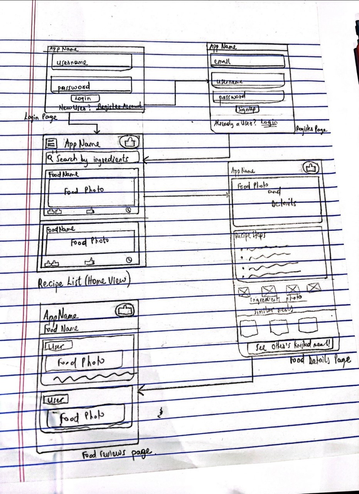

# FoodAtHome

## Table of Contents
1. [Overview](#Overview)
1. [Product Spec](#Product-Spec)
1. [Wireframes](#Wireframes)
2. [Schema](#Schema)

## Overview
### Description
This app will give users access to recipes from all over the world, including the ingredients required to make such recipes. Users will also be able to select a recipe and be shown a step by step guide on how to make said food. Recipe timeline can also be split into food caregories, eg: soups, desserts, etc.  Good stretch feature will be to have users enter ingredients they currently have/want to make food with, then the app brings up a list of food that can be made with the inputted recipes. Another good stretch feature will be to allow users give reviews on the recipe and also upload a picture of their finished food after following a recipe. Also users can follow a video walkthrough on recipes.

### App Evaluation
[Evaluation of app across the following attributes]
- **Category:** Food
- **Mobile:** Mobile is easier to have around and view on while cooking. Mobile will have access to camera to upload their finished meal.
- **Story:** Allows users to be exposed to meals of different cultures, healthier food, and also share their food lifestyle.
- **Market:** Everyone eats, and people are mostly to willing to try out new recipes all the time. Also people who have limited ingredients can find a variety of meals to make with their ingredients.Also for people who have ran out of ideas on what food to make.
- **Habit:** Trying out new food is exciting! and everyone eats everyday. Being able to make something you have never and for it to come out good leaves one feeling very gratified. Users will have the expectation of making new meals and experiencing how they taste and that forms habit.
- **Scope:** Start out as viewing recipes, their artings and time to prepare them, and the ingredients needed for said recipe, as well as and accessing recipes particular to some ingredients. Subsequently users adding reviews, posting their finished meals. Later to include videos to follow for recipes.

## Product Spec

### 1. User Stories (Required and Optional)

**Required Must-have Stories**

* Users can login
* Users can create new account
* Users can see a list of recipes
* * Users can input ingredients for which they want to see recipes for
* Users can navigate from list of recipes to see recipe details, and ingredients

**Optional Nice-to-have Stories**
* Endless scrolling through recipes
* Users can upload a finished picture of their meal
* Users can select from specific food type eg:soups
* Recipes will have a video walkthrough

### 2. Screen Archetypes

* Login Screen
    * Users can login
    * Users can register for a new account
* Stream
    * Users can see a list of recipes
* Detail
    * Users can click on a recipe to see a detailes view eg: estimated time to complete meal, ingredients, etc for a particular meal.
* Creation
    * Users can upload a picture of finished meal

### 3. Navigation

**Tab Navigation** (Tab to Screen)

* Home feed
* Recipe detail
* Post food

**Flow Navigation** (Screen to Screen)

* Login Screen / Registration
    * to Home (recipe feed)

* Recipe feed
    * to recipe detail
* Recipe detail
    * to post finished meal

## Wireframes
 

## Schema
### Models
#### User

| Property      | Type     | Description |
   | ------------- | -------- | ------------|
| objectId      | String   | unique id for the user post (default field) |
| username      | String   | User's username |
| password         | String     | User's password |
| createdAt     | DateTime | date when post is created (default field) |
| updatedAt     | DateTime | date when post is last updated (default field) |

#### Post

| Property      | Type     | Description |
   | ------------- | -------- | ------------|
| objectId      | String   | unique id for the user post (default field) |
| author        | Pointer to User| post author |
| image         | File     | image that user posts |
| description       | String   | image description by author |
| createdAt     | DateTime | date when post is created (default field) |
| updatedAt     | DateTime | date when post is last updated (default field) |

### Networking
#### List of network requests by screen

- Create Food review post Screen
    - (Create/POST) Create a new post object
- Login Screen
    - (Read/GET) Query registered user object
- Register Screen
    - (Create/Post) Register new user object

